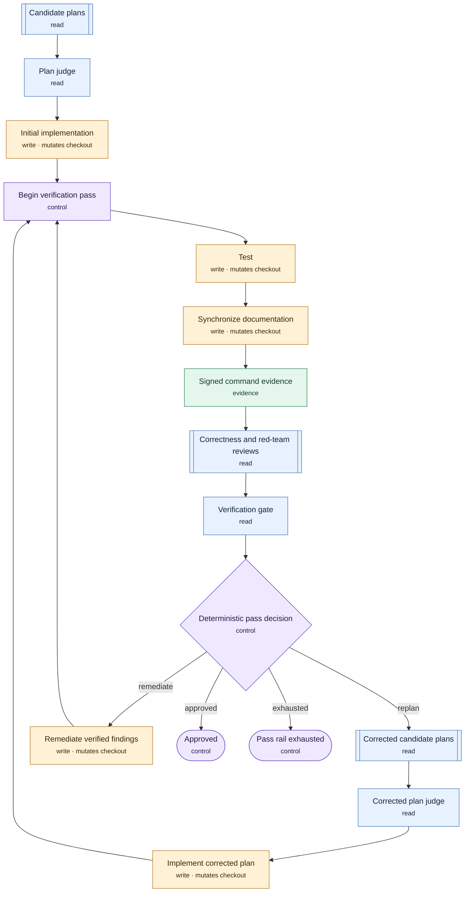
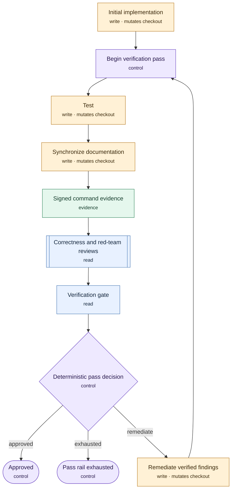
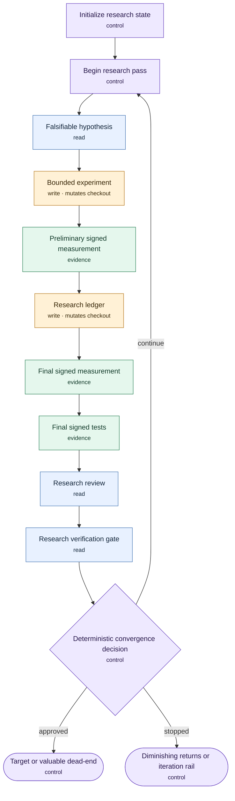
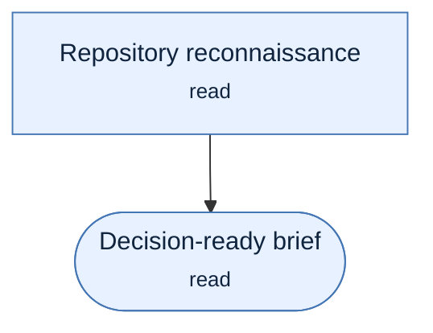
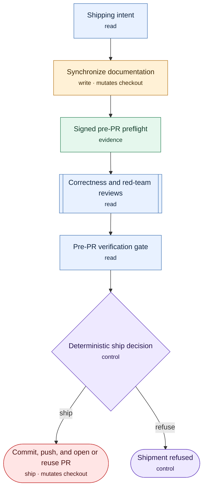
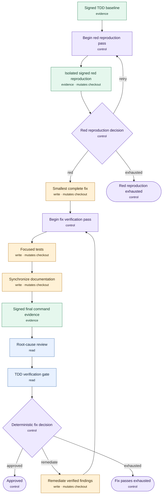

# Workflow graphs

This file is generated from the validated graph-mode definitions. Do not edit it directly; run `npm run graph:generate`. Original mode remains the default, and these diagrams describe only the secondary graph-mode scripts.

## Helix delivery

Competing plans, serialized implementation, complete evidence passes, remediation, and correctness-triggered replanning.

Definition digest: `c7133f7c73195b4a6e5f3f619ef054eab2bfed6bfc63c312510890834687b81c`. Derived absolute step ceiling: `71`.

Cycles:

- `verification-loop`: entry `verification-pass`, maximum 5 traversals.

## Helix implement-review

Settled implementation followed by bounded complete evidence and remediation passes.

Definition digest: `3d74d6dd974ee3f146be11c8e5a1cc8dae2040f6efa2b5ab37e57bd65941b852`. Derived absolute step ceiling: `51`.

Cycles:

- `verification-loop`: entry `verification-pass`, maximum 5 traversals.

## Helix research

Bounded hypotheses and experiments with signed final measurement, tests, and deterministic convergence outcomes.

Definition digest: `7679fb90d36d7aca03ad87d2d759ee983b6bee2c5ac322941fe8259ac868841a`. Derived absolute step ceiling: `63`.

Cycles:

- `research-loop`: entry `research-pass`, maximum 5 traversals.

## Helix scout

Read-only reconnaissance followed by a decision-ready implementation brief.

Definition digest: `d37683594f6a5630e82bf97014b461bb78dd2c5fb79aaf89d3d4799bc3368200`. Derived absolute step ceiling: `2`.

Cycles:

- None; this workflow is acyclic.

## Helix ship pre-PR

Exact intent and preflight, documentation, dual review, deterministic gate, then one bounded shipment effect.

Definition digest: `bbd9646875b553ca9fb876ad16e79d69c9432afcaaba5628c9e82b2c9bfb8989`. Derived absolute step ceiling: `8`.

Cycles:

- None; this workflow is acyclic.

## Helix TDD fix

Signed baseline, bounded isolated red reproduction, smallest complete fix, and bounded complete evidence passes.

Definition digest: `fefc1fd564bd435b7d3654a2c05c3880fc341184cbf7153b7d52a5422d9af285`. Derived absolute step ceiling: `62`.

Cycles:

- `reproduction-loop`: entry `reproduction-pass`, maximum 2 traversals.
- `verification-loop`: entry `verification-pass`, maximum 5 traversals.
